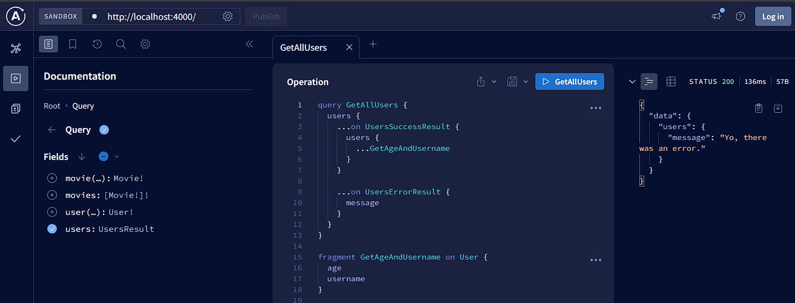

In this project, i try to deeply understand [GraphQl API](https://graphql.org/learn/) inner working.

## SOME KEY POINTS OF MY LEARNING
- it requires only one endpoint
- it solves underfetching and overfetching problems introduced by RESTful API

GraphQL API is like a query language which has 5 basics types.
- Boolean
- Float
- ID
- Int
- String

We can define a custom type using `type` keyword. Below is an example.
```bash
type <entityName> {
    <field>: <basicType>
}
```
! in front of a field type makes it no nullable.
? in front of a field type makes it optional.
`[type]` helps define an array of type.

GraphQL comes with two kind of requests: `queries` (like GET method) and `mutations` (to alter or modify data as POST, PUT, PATCH, DELETE methods).

To build a GraphQl API, we need to define a schema to which we should bind a resolver.

`Query` type is the entry point of every GraphQL API. It serves data like GET endpoints on REST API

type, enum, input, fragment, union, type Query, type Mutation

To make all of this in practice, i setup a GRaphQl API in Node.JS using `apollo-server` server-side and `@apollo/client` client-side in React. I also install `graphql` lib.

Here is an example of GraphQL API querying using union stuff
```bash
query GetAllUsers {
  users {
    ...on UsersSuccessResult {
      users {
        ...GetAgeAndUsername
      }
    }

    ...on UsersErrorResult {
      message
    }
  }
}

fragment GetAgeAndUsername on User {
  age
  username
}
```

[Here](https://youtu.be/yqWzCV0kU_c?si=nUZAZacseG73KP5G) is a good resource for learning more stuff about GraphQL API.

## Server-side
|  |  |  |
|---|---|---|

## Client-side
|  |
|---|
